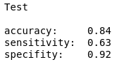

# sentiment-analysis

Learning sentiment analysis using various NLP techniques
- Tfidf/Count vectorization coupled with naive bayes, logistic regression, etc.

# Results

## Test metrics

### Using count vectorizer

### Using tf idf

## Using wordToVec embeddings and taking average of all word's embedding

## Model explanations

### Usin LIME

### Using Logistic Regression count vectorizer

Words with their importances in positive or negative prediction

### Using Logistic Regression tfidf

Words with their importances in positive or negative prediction

